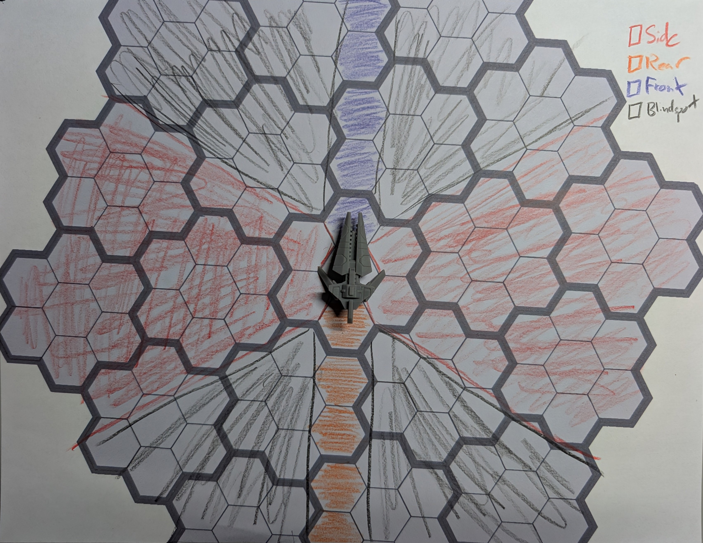

I'm kinda jealous of seeing my friends chat about selling their finished games at conventions and such, so I'd like to finish a game too (mostly just because I want to hang out with them more, but don't tell them that). I also made a resolution that I was going to write at least 12 blog posts this year, so this is me getting started on that, too.

I'm currently working on a game called Drone Drifters. It's a tabletop role-playing game about space fighter pilots that control drones with the power of their minds. Drifters can actually switch which drone they are controlling mid-dogfight (they _drift_ between drones), so the the party kinda controls a whole fleet together, opposed to each player having their own specific ship. It's a tactical game with movement and positioning, hence the use of spaceship minis and a hex grid in the banner image, as well as a large focus on collaboration between players.

I've playtested it a couple of times with my friends already, but there is still a lot to do for me to feel like I have real progress towards a finished project. The combat playtest actually went really well, so I think the majority of the work on that front will be just expanding the options and writing out the actual rules (so far it's been a verbal-only explanation). The role-play focused playtest went _fine_, so I think a lot can be done to tighten up that part of the experience. There are also subsystems and setting information that I would love to have for at least the first full iteration/edition that have not had any development yet.

The remainder of this post is just going to be a stream-of-consciousness bullet-pointed list of the things that I still need to work on for the first edition of Drone Drifters:

- **The downtime subsystem.** I imagine this working kind of like [Draw Steel's downtime projects](https://steelcompendium.io/compendium/main/Rules/Chapters/Downtime%20Projects), where there are a defined number of things that a drifter can do during periods of extended rest--each should have some mechanical benefit. It should also be understood that these actions need not be the _only_ things done during downtime, as I imagine most of the roleplaying will actually happen in downtime, i.e. between battles.
- **The role-play core resolution mechanic.** We tried a version of a general resolution mechanic in our second playtest and it did not perform very well. The gist is stolen straight from [Honor + Intrigue](https://www.drivethrurpg.com/en/product/99286/honor-intrigue) (but modified to remove some things that likely makes H+I a more fun experience 🤦): each drifter got a number of Ranks (5 I think it was?) to assign to their choices of Careers, which act kind of like backgrounds for their character, describing what kind of life they may have lived before becoming Drifters. A higher rank means more time spent in that career, gaining experience in it and learning tricks of the trade. They could split the 5 up however they wished, the only stipulation that a single career could not have higher than rank 3. Whenever a situation arose that necessitated a role, the player would roll 2d6 and add the rank of any relevant careers (i.e. if you're trying to pick a lock, you might add your Criminal and/or Spy careers); if their total is greater or equal to 7, the action is a success. We did a lot of rolling during the playtest (the characters were racing each other across the length of their main spaceship), and the general feel was that it was a little too easy to succeed, and that pass/fail felt kind boring. A specific quote was something akin to: "I kept wishing it was it was PbtA, and was sad when it wasn't." I think a significant (at least non-negligible) aspect of the dissatisfaction was my own inexperience as a GM, but I did feel like the pass/fail aspect of the dice rolling was limiting and dampened the fun somewhat, so I'll definitely be looking at trying out some alternatives.
- **More Stars, Scars, and Drone Systems.** From the get-go, I've known that the bulk of the design work was going to be on these 3 things. Stars, Scars, and Drone Systems are basically the special abilities of the game--Stars and Scars define characters, and Drone Systems are upgrades you can make to your drone fleet. I'd like each category to have a huge list options that players can pour through like a catalog for progression. I've worked out that, rather than levels or other similar progression systems, each battle (and perhaps each session) will award the players with a number of Credits that they can spend on new stuff, Stars, Scars, and Systems being among the options. This makes for a sort of constant creep up in power, which I find to be fun. I also just personally love the games that let me sit down between sessions and search through a huge list of options to find the perfect option for me (thinking specifically of getting new spells as a wizard in D&D 5e), so I'd like to have a few mechanics in place that satisfy those players who may feel the same. [I have several of each of these things already](https://github.com/trevclaridge/Drone-Drifters/tree/main/Core%20Mechanics/Player%20Options), but I definitely could use a lot more.
- **The Combat Rules.** These are already shaping up to be pretty good, but they only exist in my mind, and in the minds of the players of the one combat-focused playtest, so they really just need to be _written down_. Just writing stuff down is an area that I really struggle with (as should be obvious from the lack of posts on this blog); I'm going to need to find a way to force myself to get better at the technical writing parts of game design. I need to make the time and the effort, or my game project will never get finished. For this section of the game manual, I also foresee myself making a lot of diagrams, to better lay out the mechanics surrounding the hex grid.

- **Setting.** I've kind of gone back and forth on this one as of late. This game is heavily inspired by Battlestar Galactica, as I'm watching the series for the first time, so a lot of my examples when talking about this game with friends has been centered around a specific campaign that shares a lot of same story beats as the show: home planet destroyed, on the search for a new home, spaceship battles centered around a mothership, etc. Over the course of the game's development though, I've also tried to maintain some agnosticism about the setting and core assumptions of the game--I wanted people to be able to use the same set of rules for any number of scenarios. As I write and develop more, though, I wonder if I ought to just lean in to the influences and prescribe the setting--make the campaign idea core to the game and have these elements listed above be baked in. I feel as though there are pros and cons to either approach. Those aren't the only two options of course, I could also totally add those campaign elements into the first edition as a starter adventure, for example, but I do wonder if embedding some of those assumptions as core to the game might make the develop process easier, as well as allow for some more interesting theming.  

I think that's enough for now. I still have a lot top of mind that I feel needs to be listed out so I have a better visual of the work needed, but I think perhaps writing that up as a sort of Table of Contents may work better for me. I did [something similar for my other project, Writ of Rulers](https://github.com/trevclaridge/Writ-of-Rulers/blob/main/Misc/Table%20of%20Contents.md), and it helped me find some gaps that a list like the above can miss. As for now, though, I think the above do encapsulate the huge bulk of the missing material. I'm sure I will remember something later tonight that I forgot and will need to make a hasty edit to this post. Looking forward to that inevitability.
