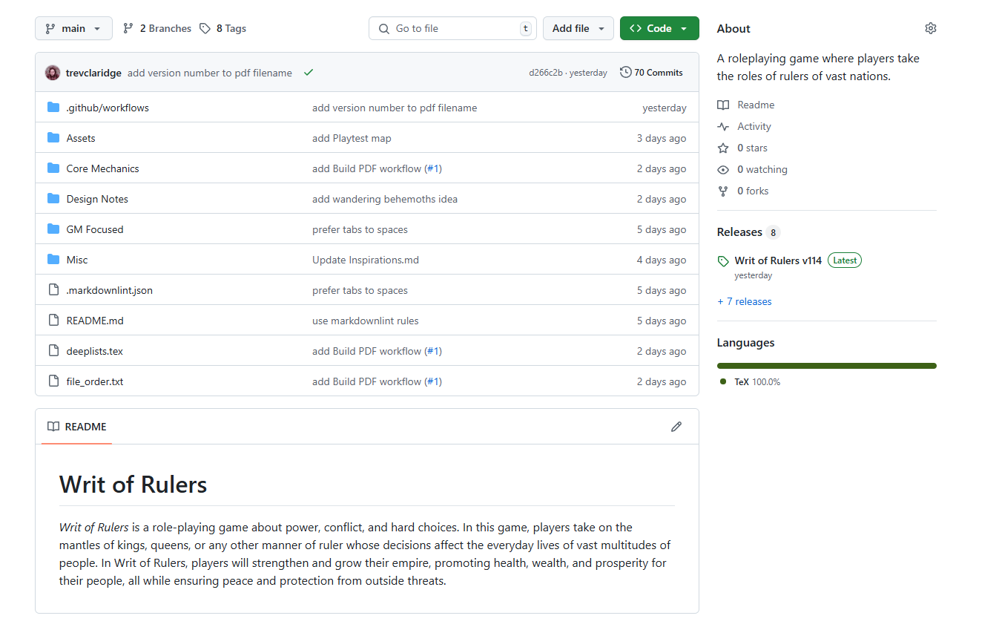
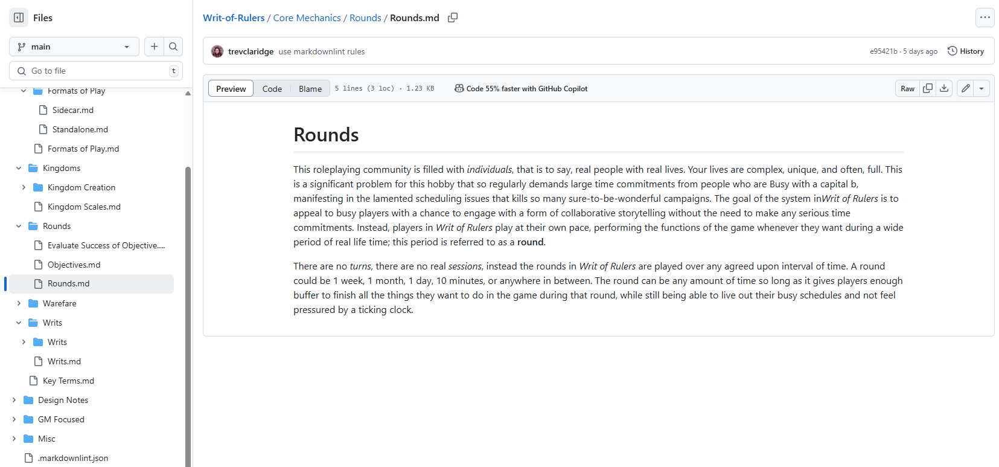
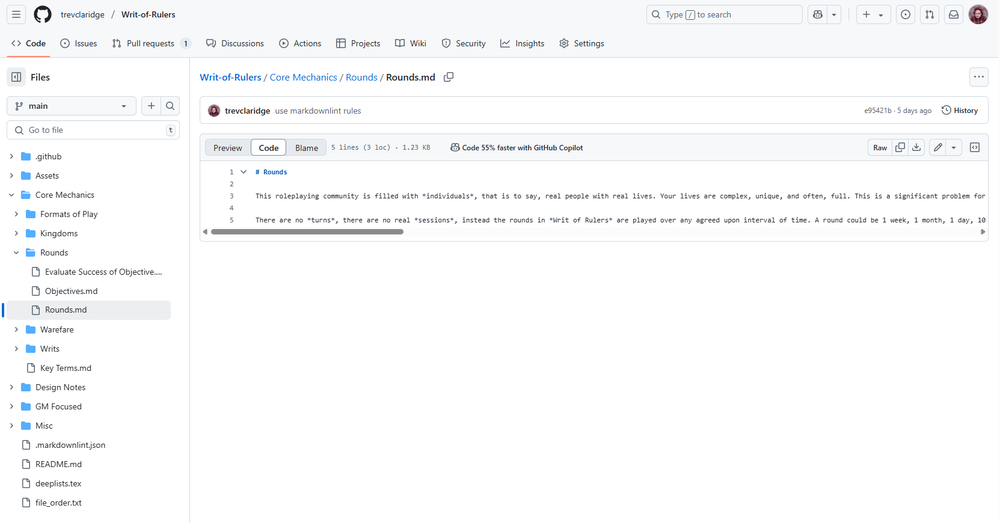
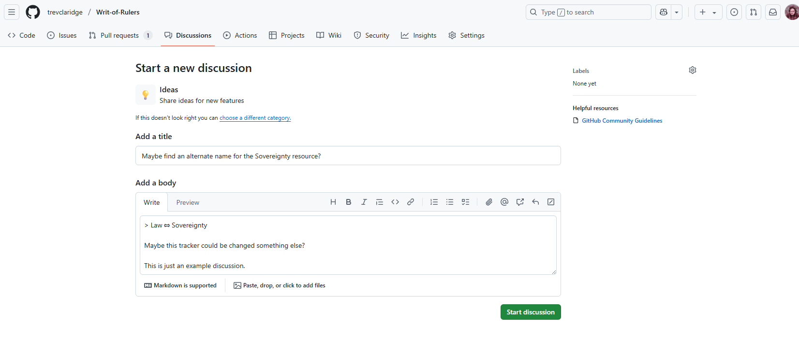
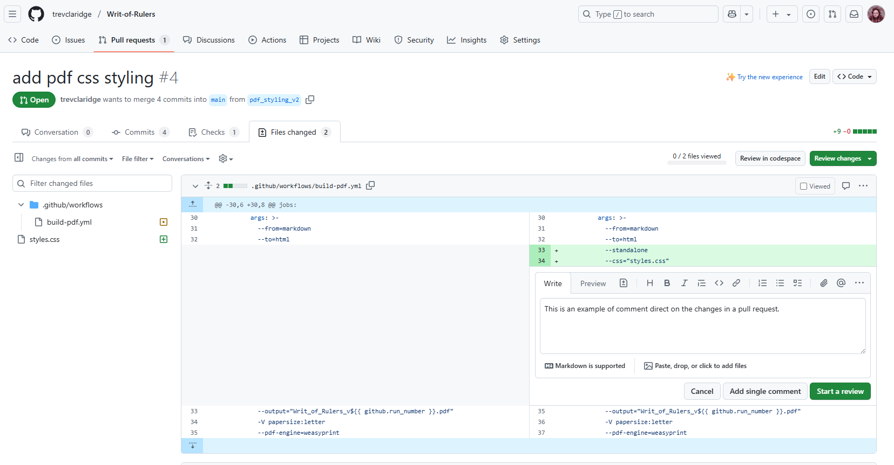

Inspired by [this video about the benefits of storing work as plaintext from No Boilerplate on YouTube](https://youtu.be/WgV6M1LyfNY?si=Tza_82vvo6qPo_DC) (highly recommend giving it a watch), I recently moved all my various notes for my game *Writ of Rulers* to a [Git repository hosted on GitHub](https://github.com/trevclaridge/Writ-of-Rulers). For this post, I wanted to talk a little bit about what movitated me to do so, what kinds of issues you might face in the process, and then how I plan to continue to utilize the benefits this new system provides me. If I can pique your interest towards possibly following suit, that's a nice bonus!

## What is Git?

My hope is that this post makes its way to some other game designers out there who may be looking for a new way to track the progress they are making on their games. As not all game designers are also programmers, its worth taking a few moments to just give an overview of what Git is and what makes it so important for this workflow.

Git is a "version control system," or VCS for short. Basically, Git tracks *changes* to files. Whenever you make an edit to a file that is tracked in Git, those changes are made part of that file's permanent record, giving you a very detailed history of the entire lifecycle of the file. Entire directories can be tracked in Git, with every change to every file within recorded for posterity. Importantly, Git also allows you to revert to previous versions with ease; you can pick a "commit" (basically the snapshots Git uses to track changes) from ages past and revert your entire file system back to that time without missing a step--then you can jump back to present day or any time in between at will. Every change ever made is retrievable, and, importantly, without the need to create manual backups of files.

The video linked above talks a bit about why programmers use Git. Git has become something of an industry standard for software development because the features Git provides lend themselves so perfectly to coding. Software development involves a lot of time reading and writing plain text; most software is just a whole bunch of loose text files with weird file extensions that all get combined together in a complicated compilation process to produce the technology we use daily. Developers also need to have very clear understandings of how the softwares we work on change over time. If there is a bug in version 2 that wasn't in version 1, we need to know what changed between those two versions so we can identify what introduced the bug. Git also allows us to be very careful about what new code is being introduced in real-time: if I want to add some code to the main code base, another developer takes a look at my Git changes to ensure I didn't miss anything or introduce any obvious bugs--this process is called a "code review." If my Git changes look good and get a thumbs up from the reviewer, then I can merge those changes with the main code. Merging is just another text change tracked in Git, so if my code did introduce a bug, we can super easily revert the main code to the version right before my code was merged in.

These are the main features of Git, but, honestly, Git is kind of magic. There are a whole bunch of other features that will be useful for any number of specialized projects, but really you only need to know a few basic commands to get *a lot* done. In fact, if you start to dig into Git, you may run across some jokes around how only like 4 commands are used by a vast majority of people; the "Git is kind of magic" phrase from before is something I heard verbatum from my college computer science professor.

If Git sounds interesting to you, just doing a quick Google or YouTube search for "Git Basics" will provide you with a wealth of cool tutorials.

## What about GitHub?

GitHub is a whole megaton of things, but for the purposes of this post, is just an online tool you can use to easily externally store your Git changes (aka your Git "repository"). I'll talk more about the GitHub a little later as I talk about my reasoning for transfering my game notes there, but for now, just know that GitHub basically provides a location to host your files and change history and has a nice UI for navigating those files and version history, managing changes and triggering automated workflows on the introduction of new changes, and making your files and history public to allow easier collaboration with others (GitHub and other sites like it are critical to the Open Source community).

Below you can see a pic of the home page of my GitHub repository for *Writ of Rulers*.

As you'll see, it is basically just a visualization of a folder. Clicking any of the files or folders allows you to view the contents. [Give it a try](https://github.com/trevclaridge/Writ-of-Rulers). At the top you can also see the most recent change is being shown: "add version number to pdf filename" is the little comment I attached to the change to describe what the change is. Then, over on the right hand side of that same line, is a string of numbers and letter, "d266c2b", which is the unique ID of the change, which I can use if I ever want to revert my work to that exact version; by the time you read this post, that ID will likely have changed as I make additional changes to my game. Right next to the ID, "70 Commits" implies that the text stored in the repository has changed at least 70 times since I opened the repository. Every single one of the changes represents a snapshot of my text that I can flip back to a moments notice.

## What does all of this do for game design?

Okay, all the above was a lot more than I expected to write about Git and its uses, but hopefully with all of that foundation, the transition to game design and iteration is a little smoother.

I adopted Git for my project because I was struggling with making a cohesive and useful system to track all the different changes and iterations of my game I was producing. Iteration is hugely important thing for game design (consider: playtesting) and I really wanted to keep a record of how iteration was affecting the development of my game. This interesting is largely inspired by [this podcast episode on iteration by Design Games](https://designgames.simplecast.com/episodes/42), as well as my real life friends that also design games, who keep all of the different versions of their games in hard copy; I'm always jealous when we meet up and they pull out newer and older versions of character sheets and such for us to compare. Having a record of changes gives a great view into the design process and can aid further design work by bringing into focus thoughts and ideas that may have been forgotten otherwise (game design can be a long process and memories have a funny way of disappearing over time).

In addition to version tracking, hosting on GitHub also has the basic benefit of just coalescing a bunch of scattered writing into one central, easily shareable place. For a long time now, I've been using [Obsidian](https://obsidian.md/) to write my game, and while I do like it as just a barebones text editor with some useful features, it has some of the same problems my other file systems have in that I have to record changes manually (by making a new file with something like "v2" in the title), and if I ever want to share some piece of writing with anyone else, I have to go through some sort of multi step process:

1. Take a screenshot

	- not super useful if they want to copy-paste.
	- if the text is too long for a single screenshot, that means sending mutliple photos, which is just cumbersome

2. Copy-paste the text from Obsidian

	- Obsidian markdown (the plain text file type Obsidian and many other programs use) and Discord markdown is not always 1-to-1; leading to some visual issues when copy-pasting
	- Sometimes I want to send more than a little text; Discord has message length limits, so I have to break up the text into multiple messages

3. Send them the full file

	- Discord also has a file size limit. This doesn't come up very often in my workflow, but if your document has a lot of images, this could become a problem quick.
	- Obsidian has a bunch of proprietary little formatting and interactive things that might not translate correctly to a pdf document.
	- Sending a file from Obsidian means sending the original markdown file, or exporting to a pdf, both of which requires some navigation, either through menus to export or through a file system to find the right file.
	- Sending files directly always feels a little weird, just because of the possible security risks the other person is opening themself up to by downloading files.

None of these are horribly inconvenient, and I use any combination of all 3 of them during daily work, but it is *just* annoying enough in combination of the version issues for me to start thinking about alternatives. Enter Git and GitHub, basically.

Using Git automatically gets me the version control I want, and should I ever want to share a piece of writing with anyone, I need only send them a link to that file's specific GitHub page. Importantly, I'm using the same markdown language to write the game, which GitHub convienently renders straight to page in a pleasent way, so the other person doesn't need to do anything special to view the writing; it's a quick copy-paste of a url for me, and single click for them.

Below is an example of how these files are rendered:

[Link to the above](https://github.com/trevclaridge/Writ-of-Rulers/blob/main/Core%20Mechanics/Rounds/Rounds.md).

Compare that to the file source text (seen by clicking the "Code" option towards the middle page):

[Link to the above](https://github.com/trevclaridge/Writ-of-Rulers/blob/main/Core%20Mechanics/Rounds/Rounds.md?plain=1).

## Downsides?

Totally.

### Non-text content

This whole ecosystem works as well it does for me because I'm only barely in the ideation and writing stage of my game. My entire time is spent writing *plain text*. I know a lot of people are both the writers *and* artists for their games, some even going as far as writing straight into the graphic design layout their game will eventually use. I don't really have a visual design bone in my body, so that will be someone else's responsibility should my game ever reach publishing stage. Git can track *any* file, so utilizing it for things like Affinity projects or art assets is not discouraged, it just doesn't doesn't have as deep of visibility into changes as text does. [I'm storing some art assets in my repo](https://github.com/trevclaridge/Writ-of-Rulers/tree/main/Assets), but Git can only track that the file changed, not what changed in the actual asset, as in, it's not going to know that you changed one shade of green to another, unless that is expressed as something like a hexcode in an svg.

### Editing

Another thing that was brought up by a friend is GitHub's lack of a direct "suggesting" mechanism. Now, GitHub *does* have a whole slew of tools for conversations and suggestions in the forms of GitHub Discussions and the conversations allowed on Pull Requests, but those come with some added nuance that might put off some people who might be looking to go through a more thorough editing process on GitHub.

- **Conversations** act kind of like forum posts. People can create new threads, in which you can discuss any number of things relating to the repo, with a bunch of built in features. The only downside from an editing perspective is that these conversations are not happening right on the source like you might find in the Suggesting mode of Google Docs or similar. Instead, if you'd like to discuss specific sections for grammer, word choice, or anything else, you will need to quote that section and perhaps add a link to it.

- **Pull Requests** are the mechanism by which collaborators can stage any changes they'd like to make before officially moving them into the main line text. Pull requests are a big concept in Git, as they allow people to signal that they'd like to make changes, and allow maintainers of the project to approve or ask for additional tweaks before those changes are made official. The UI for pull requests allows comments to be made directly on the changes, without the need of linking or quoting, and is a little to closer to other editing workflows. The big difference, however, is that pull requests are only created for *changes*. An editor therefore can only comment on those changes  and cannot make comments on existing writing.

These options don't leave open a lot of great options for playtesters and such to point out the little things like typos. Now, if your playtesters have some know-how, they can create a pull request that just fixes the typo and get you to merge it, but that assumes a level of technical knowledge that is not generally expected of those outside the software world.

I'm early enough in my Git adoption for this project that I have not really identified any other major downsides. If anyone has experience hosting their game on GitHub has run into any other issues, I'd love to hear about it. Same goes for any recommendations for how to fix the above issues.

## What comes next?

The utilization of Git and GitHub has effectively solved my iteration and sharing problems for now. Being a software dev, I look forward to the opportunities this move gives me to employ some of my skills in really refining my environment with some coding and automation. I was planning on speaking more to the small issues I've run across and fixed, specifically things like using a markdown linter to standardize the formatting of my text (I've been using the [Markdownlint VSCode extension](https://marketplace.visualstudio.com/items?itemName=DavidAnson.vscode-markdownlint) and my [.markdownlint.json to customize the rules can be found on my repo](https://github.com/trevclaridge/Writ-of-Rulers/blob/main/.markdownlint.json)), but this post has already gone long and those are mostly cosmetic things. In terms of automation, I've already spent several days falling down a rabbit hole of trying to generate a pdf file from all the markdown files in my repo. I was finally successful yesterday, and that'll be the subject of my blog post. Look forward to it, nerds.
